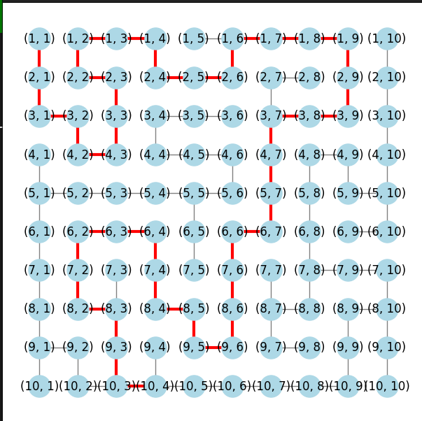
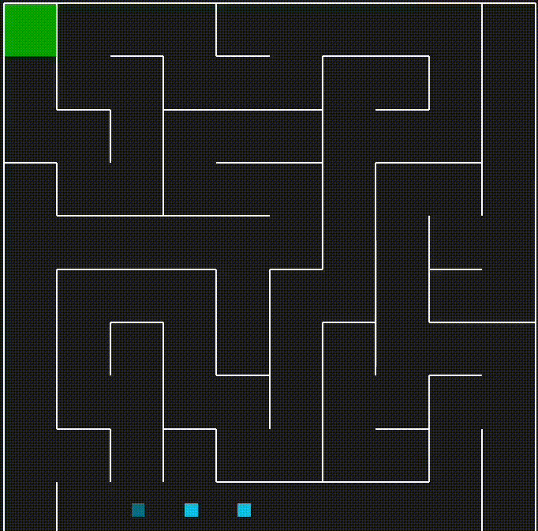

<h1 style="text-align: center; color: #f8f9fd;"> Algoritmo de Navegação em Labirinto</h1>

<p style="font-size: 18px; text-align: center;">
    Este projeto implementa um algoritmo de navegação para um <strong>labirinto</strong>, utilizando <strong>grafos</strong> e o <strong>algoritmo de Dijkstra</strong> para encontrar o caminho mais curto.
</p>

<p align="center">
    
    
    
    
    
</p>

---

<h2 style="color: #f8f9fd;">📌 Descrição</h2>
<p>
    O código gera um labirinto, transforma sua estrutura em um grafo e aplica o algoritmo de Dijkstra para encontrar o caminho mais curto entre dois pontos.
    O resultado é visualizado graficamente, destacando o trajeto encontrado.
</p>

---

<h2 style="color: #f8f9fd;">🎮 Como Executar</h2> <ol> <li>Instale as dependências:</li>

```bash
pip install pyamaze matplotlib networkx
```

<li>Clone o repositório:</li>

#TODO atualizar repositório no link
```bash
git clone https://github.com/seu-repositorio.git
```

<li>Entre no diretório do projeto:</li>

```bash
cd nome-do-projeto
```

<li>Execute o script:</li>

```bash
python main.py
```
</ol>

<h2 style="color: #f8f9fd;">📌 Resultados</h2> <p>Os resultados incluem a visualização do grafo gerado e a animação do agente percorrendo o labirinto.</p> <h3 style="color: #f8f9fd;">🔹 Grafo Gerado</h3> <p>O grafo do labirinto é representado como uma estrutura de nós e arestas, destacando o caminho encontrado em um labirinto 10x10.</p> <p align="center">  </p> <h3 style="color: #f8f9fd;">🔹 Agente no Labirinto</h3> <p>A animação abaixo mostra o agente percorrendo o labirinto utilizando o caminho encontrado pelo algoritmo de Dijkstra.</p> <p align="center">  </p>


<h2 style="color:#f8f9fd;">📩 Contato</h2> <p> Desenvolvido por <strong>Gerliane Chaves</strong>. Para dúvidas ou sugestões, entre em contato: </p> <a href="gerliane.schaves@gmail.com" style="text-decoration: none; background: #000427; color: white; padding: 10px 15px; border-radius: 5px;"> 📧 Enviar E-mail </a> 
